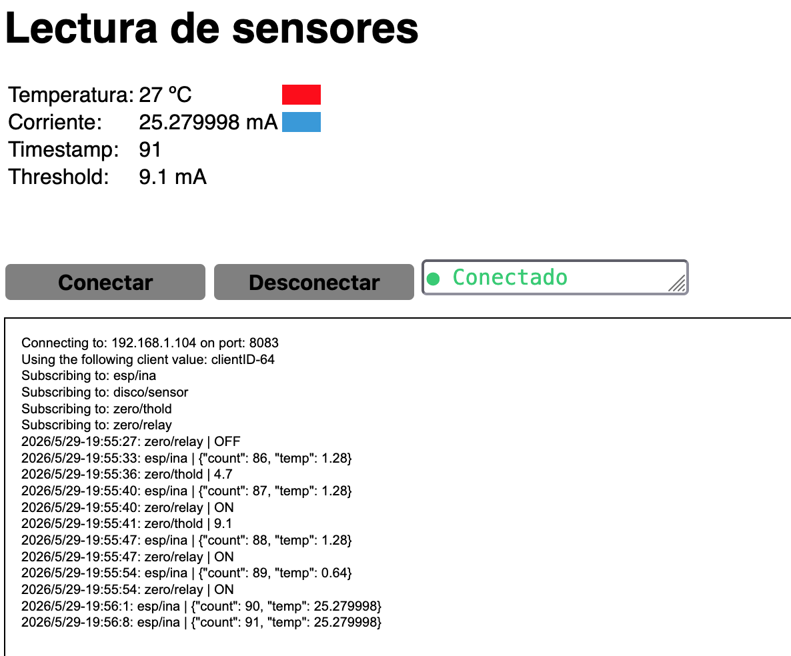
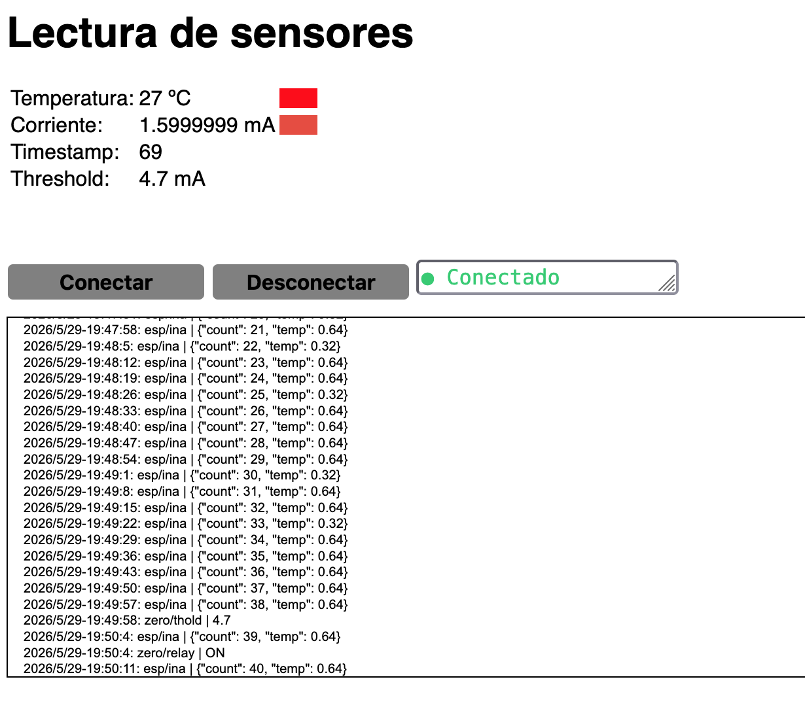
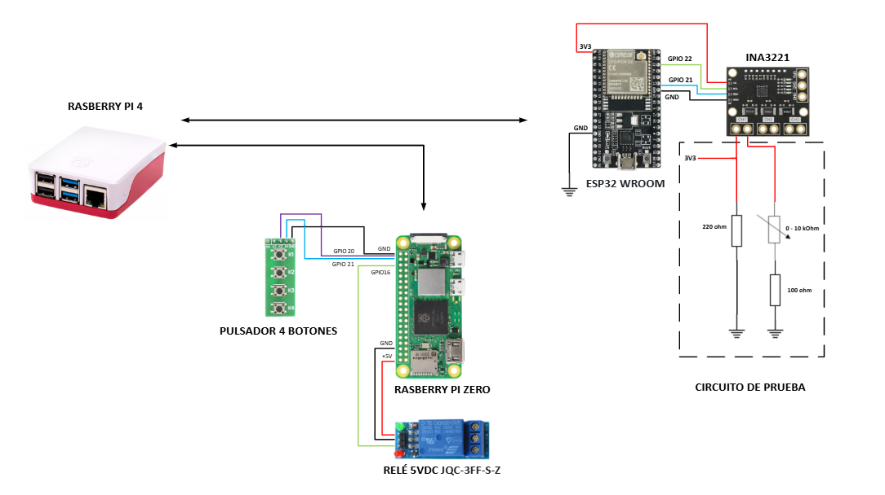
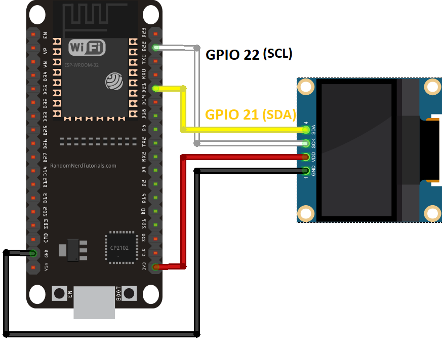
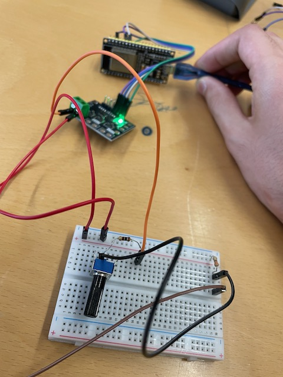

# Battery Monitor

1. Introduccion
2. Componentes
3. Esquema eléctrico
4. Troubleshooting

## Introduccion

Se propone el desarrollo de una aplicación para la monitorización de la carga de una bateria. La aplicación utilizará el siguiente hardware:

- Raspberry Pi4 (RPi4) donde corre los servidores de la aplicación
- Raspberry Zero (pizero) con un rele y cuatro pulsadores
- ESP32 WROOM con un sensor INA (simula el SoC de una bateria)
- B-L475E-IOT01A Discovery kit.
- Bourns 10kΩ Rotary Potentiometer 
- [Pulsador](https://www.amazon.es/interruptor-Akozon-Interruptor-pulsador-universal/dp/B08N44GQ5Q/ref=sr_1_7?) de 4 botones y relay 5VDC (JQC-3FF-S-Z)

Suponemos que el ESP32 esta justo al lado de una bateria la cual se quiere monitorizar (simulada por un potenciometro).

El rele de la pizero simula una alarma. Se activa cuando el valor de voltage medido por el INA3321 es menor que un **threshold**. Asi mismo, el valor del threshold viene determinado por la pulsacion de los dos botones segun la tabla siguiente:

| Boton |  mA |
|---|--------|
| A | 9.1|
| B | 4.7|

La pizero publica este valor en el topic_threshold. Suponemos que la pizero es solo el interfaz HMI del sistema, con lo que no tiene capacidad de decision sobre el rele (no esta subscrita al topic_esp).

En node-red se muestra en un gauge el valor de voltage / corriente de la bateria y valor del threshold.

| NRed | UI |
|------|----|

A parte de Node-Red, la RPi4 tendra otro servidor web local con el valor de corriente medido. Si esta por debajo del **threshold** se muestra de color azul (rojo de otro modo). 

| Corriente OK |  Alarm |
|-----|--------|
| |  |

A parte de la consola de Javascript, se ha creado una seccion con los logs mas representativos. La funcion **updateCurrent** (fichero functions.js) es la que actua sobre el rele en el caso de que la corriente sea menor que el threshold (logica de la aplicación).

## Componentes

### Servidor (RPi4)

**Broker MQTT**

Se utilizará un broker local para publicar y suscribir mensajes MQTT.

Para la visualización de los datos de los dos nodos descritos, se despliega un servidor con **Node-RED**

- Publicación y admisión de suscripción a datos de los nodos MQTT (formato JSON)
  - **Nodo 0**: topic_relay, topic_threshold
  - **Nodos 1 y 2**: topic_esp, topic_disco
- Información de los sensores y estados de las entradas y salidas digitales. Los datos se representarán de forma gráfica,  usando un 'led' virtual para visualizar el estado del rele,
  -  ‘gauges’ para la visualización de los valores actuales de cada sensor 
  -  ‘charts’ para la visualización histórica de  los sensores de temperatura y humedad proporcionados por el nodo 2 (últimas 24 horas)

**LigHTTP**

A parte de Node-Red, la RPi4 tendra otro servidor web local que corre, un cliente de javascript embebido en HTML y se subscribe a los topics necesarios

En la carèta **claves** se incluye el fichero mosquitto.conf que habilita el protocolo websockets (puerto 8083), seguridad basada en (user + pwd) asi como los fuentes del servidor

* Los ficheros .js y .css hay que copiarlos a la carpeta /var/www/html de la RPi4

- Una vez listo, reiniciamos el servicio con `service lighttpd force-reload`

### Nodo 0 (pizero)

La pizero ofrecerá 2 señales digitales (GPIO) de entrada y otra de salida. Tanto la lectura de GPIOs de entrada como la activación del GPIO de salida se controlarán con mensajes MQTT.

- topic_relay, topic_threshold (controlado por los cuatro switches)

### Nodo 1 (esp)

El ESP32 se conectará a una WiFi (TBC). Cada 4 s enviará el valor de **dos sensores**  con un timestamp usando protocolo MQTT (**topic_esp**)

- Sensor I2C **INA3321** (modo voltage)
- Sensor de temperatura con ADC

## Esquema eléctrico



## Troubleshooting

1. config.json - contiene los parametros comunes de MQTT
1. Configuracion del Broker y Node-RED - rpi4/mosquitto.conf, rp4/flows.json
1. Contenido HTML del servidor web - rpi4/functions.js,  rpi4/index.html
1. Codigo del Nodo 0 - zero/main.py, zero/releay.py
1. Codigo del Nodo 1 - esp32/main.py, esp32/ina3221.py

Scripts utiles en la carpeta raiz:

- boot.py - inicializacion comun para ESP32 (require umqttsimple)
- install_web.sh - script que copia el contenido HTML a la ruta /var/www
- ssh_alumno.sh - para no introducir la clave cada vez que haces login en la rpi4
- alumno.key - private key que se copia en el host (la publica en la rpi4 por defecto)

#### ESP32

Hemos modificado el ejemplo *Hello_MQTT* para enviar periodicamente los datos de corriente de un sensor I2C (similar al ina219):

| conexion | detalle real |
|----------|--------------|
|  |  |

Extracto del Micropython para publicar el valor leido por el sensor de corriente (INA)

    payload = {
    "temp": simulated_temp,
    "count": count}
    msg = ujson.dumps(payload).encode('utf-8')          
    client.publish('hello', msg)

Se puede simular un valor JSON desde la linea de comando:

    mosquitto_pub -t "esp/ina" -m "{\"temp\":30.1,\"count\":100}"

Nota: aunque el campo se llama **temp**, se es esta usando la funcion **get_current**(). Se puede ir jugando con el resto de funciones de la API: get_bus_voltage(), get_shunt_voltage(), etc.

#### Web Server (Pi4)

Extracto de Javascript de la RPi4

    lectura = JSON.parse(message.payloadString);
    if (topic === window.APP_CONFIG.topic_temp){
      updateTemperature(lectura.temperatura); 
    } else if (topic === window.APP_CONFIG.topic_esp){
      updateCurrent(lectura.temp, minCurrent); 
      document.getElementById("timestamp").innerHTML = lectura.count;
    }

El script install_web.sh hace la conversion del config-file (JSON):

    echo "window.APP_CONFIG = $(cat config.json);" > config.js
    ...
    sudo systemctl start lighttpd.service

#### Raspberry Zero

Configuracion de una crontab en la Zero para el monitor los botones:

    crontab -e
    @reboot sleep 30; cd /home/alumno/iot; /usr/bin/python3 main.py > main.log 2>&1
    ...
    tail -f ~/iot/main.log

Suponemos que en esos 30s le ha dado tiempo de iniciar el interfaz WiFi, antes de lanzar los clientes MQTT. Si no, vamos a lanzar el siguiente comando:

```
cd /home/alumno/iot; screen
python3 main.py
```

You can detach from the screen session by pressing **Ctrl+a** D. To come back:

    screen -r 

