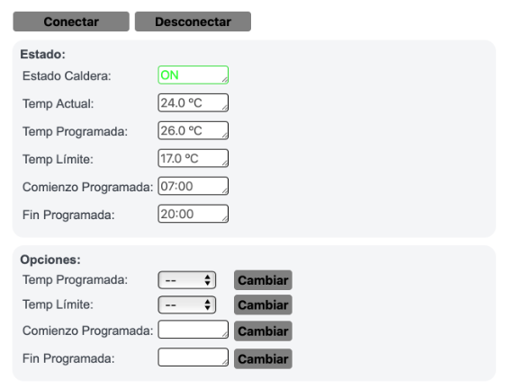
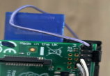

# Automatic Boiler

This project is created to turn on/off devices remotely depending on the current temperature:

| Web Interface | Relay (bolier) |
|-------------|----|
|  |  |

This turn on/off system is MQTT distribuited. Although server and UI is running in the same RPi, the system is flexible enough to run everything in different platforms. These are the system roles:

- MQTT broker where the entire MQTT protocol runs
- **Paho** client where timing is controlled and options are saved in a config file (boiler.py)
- Web server where the UI is developed, with a MQTT client to send/receive values (functions.js)
- MQTT hardware clients: to set power on/off some device (boiler.ino) or to read a remote temperature (room)

## RPi Clients

 **Raspberry Pi** where MQTT server, main client and web server runs. There is a DTH sensor (controller running boiler.py):

- Publish current temperature every 2 minutes
- Signal generated by the controller (python) and publish "home/relay/set"

### MQTT javascript (html/functions.js)

Initially this client publishes a message with the topic 'home/params/get'

Once it's connected to the broker, it's subscribed to these topics to update the web page:

1. home/relay/status
2. home/params/status/#

There are some drop-down lists with times and temperatures to be writen in the config file. This is done by publishing messages with the topic 'home/params/set/#'

### Paho client (rpi/boiler.py)

This client is subscribed to two topics:

1. home/params/set/#
2. home/params/get

The first one is to update the config file from the javascript, the other one is to read the config file and publish it within the topics home/params/status/#. 

Finally, the client is subscribed to home/relay/status but it's ignored because it is managed directly by the HW device and received by the javascript client.

There is a controller object to generate a signal to turn on the relay (home/relay/set 1) depending on the current time and temperature.

## Micropython

The **ESP device** is connected to a relay that turn on/off appliances, where an MQTT client is running

1. home/relay/set
1. home/relay/status

The code compares incoming message and activate the relay

- if digitalRead() == low → publish(“relay/status/ON”)