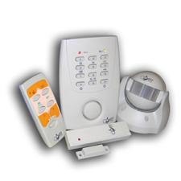

# Sistema de Seguridad Basico

El kit de alarma SIN INSTALACI�N, comunicaci�n entre elementos por radiofrecuencia, no precisa de cables. Inst�lela usted mismo! Incluye un mando a distancia, un detector de presencia PIR y un detector de puerta/ventana. Ampliable hasta un m�ximo de 12 elementos para poder proteger todas las estancias de la casa. Incorpora las funciones de activaci�n inmediata, activaci�n con retardo y funci�n de avisador de presencia con un sonido "Ding-Dong"

## Contenido del kit

* 1 unidad central.
* 1 detector de presencia PIR.
* 1 detector de puerta/ventana.
* 1 mando a distancia.
* 4 pilas AA para la unidad central.
* 2 pilas AAA para el detector PIR.
* 1 pila CR2032 para el mando a distancia.
* 1 pila CR2032 para el detector puerta/ventana.

## Caracter�sticas

* Distancia de control: 70 m.
* Funciones
    * Alarma instantanea o con retardo entrada/salida.
    * Avisador de presencia.
* Otras caracter�sticas: 
    * Indicador de bater�a baja. 
    * Protecci�n antimanipulaci�n. 
    * C�digo de 4 d�gitos personalizable. 
    * Sirena integrada de 110 dB

* Alimentaci�n: 
    * Unidad central: 4 pilas AA.
    * Detector PIR: 2 pilas AAA.
    * Detector puerta/ventana: 1 pila CR2032.
    * Mando a distancia: 1 pila CR2032.
    * Medidas del producto: 100x150x30 mm (base x alto x profundo).