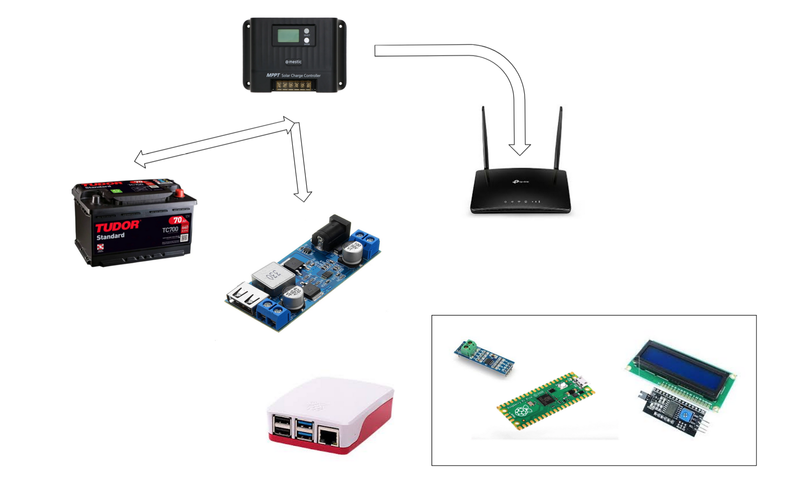

# Aguas abajo (garaje)

Opcion 1 - simpliest
- La raspberry recibe el mensaje UART y lo muestra en Javascript

Opcion 2 - home-assistant
- Este [esphome](https://esphome.io/components/sensor/jsn_sr04t/) es para el ultrasonido SR04M-2

Opcion 3 - LCD local 
- RP040 o ESP32 para poder mostrar el nivel en un LCD

## Elementos

- Solar panel con regulador MPPT
  - Flybox + SIM 4G (3 euros/mes)
  - Step-down 12V/24V a 5V (USB) de DollaTek

**Entrada del DollaTek:** Conectado directamente a los **24V** de tu batería.

**Salida USB del DollaTek:** hacia la **Raspberry Pi** para darle energía de forma segura.

**Salida de bornas (tornillos):** Llevas un cable desde el positivo al pin **VBUS** (o VSYS) de tu placa RP2040, y el negativo al pin **GND**. El regulador interno del propio RP2040 se encargará de bajar esos 5V a los 3.3V que necesita para funcionar.

## Consumos

| Concepto | Potencia |
|--------|-----------|
| RS485 transceiver |  |
| DollaTek buck converter |  |
| RP2040 + Pantalla LCD | 5V * 0.2A = 1W |
| Raspberry Pi4 | 5V * 2.0A = 10W |
| Router Flybox | 12V * 1A = 12W |
| Baterias tudor (Pb Acido) | Tudor 24V @ 90Ah / 2= 1080 Wh |
| Total 24W | 40h de autonomia |

## Referencias

- DIY or BUY aleman: [video](https://www.youtube.com/watch?v=jriRW4rGQp4&t=224s)

- I2C LCD [library](https://github.com/DIYables/DIYables_MicroPython_LCD_I2C) for ESP32, Pico, etc.

  
  
  | Concepto | Vista               |
  | -------- | ------------------- |
  | RS485    |  |
  |          |                     |
