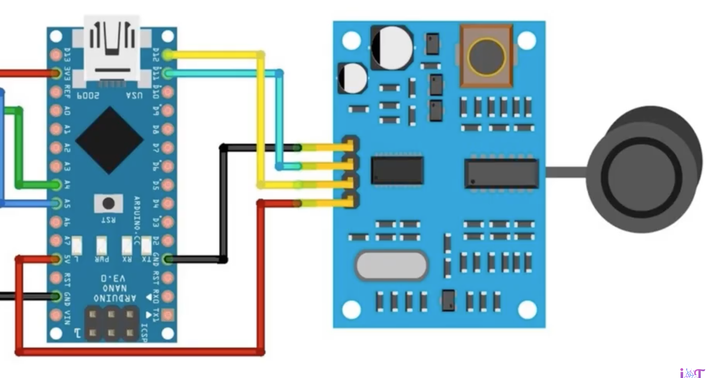

# Aguas arriba

- Alimentacion por panel solar 6V + MPPT + 18650 + 3V3 LDO
- Placa + MPPT Japo: [video](https://www.youtube.com/watch?v=pTtVe7P_lIc)

- Sensor ultrasonidos en modo [auto](https://www.youtube.com/watch?v=n0hFgR4hYqY) 
  - AJ-SR04M (R19 horizontal): [datasheet](https://www.fabian.com.mt/viewer/42585/pdf.pdf)
  - SR04M-2  (R vertical): no documentation

## KiCAD

Power Supply

- Conn_01x02 from CN3791 module
- Polarity inversion zener (D1)
- 3V3 LDO such as MCP1700-3302E
  - 10µF input cap
  - 10µF output cap

ESP32 + MAX3485

- DI → TX; RO → RX
- DE + RE tied → GPIO
- 100µF bulk cap for VCC
- Conn_01x02 (screws, differential)
- Dual TVS diode near connector (D2)

Sensor Ultrasonido

- Conn_01x04 (pin)
- Q_NMOS_GDS for GND(SR04M)
  - 10k pull down (default off)
- ECHO → divider:
10k (top); 
15k (bottom); 
midpoint → ESP32

## Material

- MPPT regulador para batería de litio 3,7V 4,2V CN3791
- Kit regulador, placa solar, display porcentaje

- Seedstudio RS485, en modo bidireccional (TBC)

Ver [protocolo](https://how2electronics.com/modbus-rtu-with-raspberry-pi-pico-micropython/) ModBus RTU y codigo [micropython](script.py)

