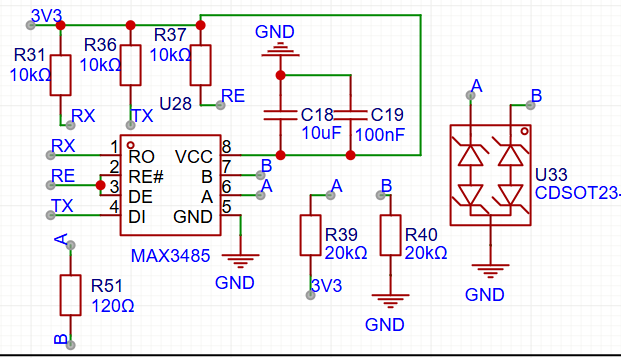

# Deposito Water level

Primero vemos lo que se instala en el deposito (aguas arribas):

- Placa + MPPT (ver [video](https://www.youtube.com/watch?v=pTtVe7P_lIc) en japonés)
- Sensor ultrasonidos AJ-SR04M (R19 horizontal): 
    - Modo [auto](https://www.youtube.com/watch?v=n0hFgR4hYqY), [datasheet](https://www.fabian.com.mt/viewer/42585/pdf.pdf)

### Implementation

- Solar panel con regulador MPPT
  - Flybox + SIM 4G (3 euros/mes)
  - Step-down 12V/24V a 5V (USB) de DollaTek
- Modulo DollaTek
  - **Entrada:** Conectado directamente a los 24V de tu batería.
  - **Salida USB:** hacia la **Raspberry Pi** para darle energía de forma segura.
  - **Salida bornas:** pin **VBUS** (o VSYS) de placa RP2040. El regulador interno se encargará de bajar esos 5V a los 3.3V que necesita para funcionar. 

### Comunicaciones

| Aguas arriba (20 mA) | Aguas abajo (200 mA) |
|----------------------|----------------------|
|  |  |
| Módulo **MAX3485** @ 3V3   half duplex, DE = RE# active high for TX | Módulo **MAX485** @ 5V; full duplex, DE active high, RE# active low (viceversa) |

### Consumos

| Concepto | Potencia |
|--------|-----------|
| RS485 transceiver | 0,5 W |
| DollaTek buck converter | 0,1 W |
| RP2040 + Pantalla LCD | 5V * 0.2A = 1W |
| Raspberry Pi4 | 5V * 2.0A = 10W |
| Router Flybox | 12V * 1A = 12W |
|  |  |
| Baterias tudor (Pb Acido) | Tudor 24V @ 90Ah / 2= 1080 Wh |
| Total 24W | 40h de autonomia |

### Alternatives

Opcion 1 - La raspberry recibe el mensaje UART y lo muestra en Javascript

Opcion 2 - home-assistant

- Este [esphome](https://esphome.io/components/sensor/jsn_sr04t/) es para el ultrasonido SR04M-2

Opcion 3 - LCD intermedio 

- RP040 para poder mostrar el nivel en un LCD

### Referencias

- DIY or BUY aleman: [video](https://www.youtube.com/watch?v=jriRW4rGQp4&t=224s)
- I2C LCD [library](https://github.com/DIYables/DIYables_MicroPython_LCD_I2C) for ESP32, Pico, etc.
- MPPT regulador de panel solar de 6V para batería de litio 3,7V 4,2V [CN3791](https://www.laskakit.cz/user/related_files/dse-cn3791.pdf)

| Name | Comments |
|------|----------|
| AJ-SR04M () | R19 horizontal |
| SR04M-2 | R19 vertical |
| Rs485 |  |
|  | Ver [protocolo](https://how2electronics.com/modbus-rtu-with-raspberry-pi-pico-micropython/) ModBus RTU y script en **esp/modbus.py**  