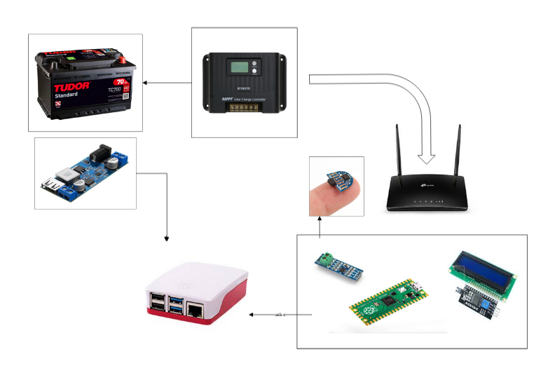
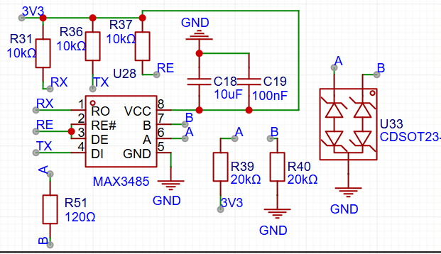
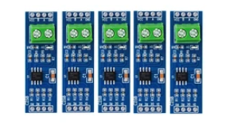

# Water level



- Step-down a 5V (USB) de DollaTek:
  - **Entrada:** Conectado directamente a los 24V de tu batería.
  - **USB:** hacia la **Raspberry Pi** 
  - **Bornas:** 
    - RP2040: **VBUS** (o VSYS) de placa, el regulador interno se encargará de bajar esos 5V a los 3.3V 
    - El controlador PCF8574, el cual es un Expansor de IOs controlado por I2C. 


### Comunicaciones

| Aguas arriba (20 mA) | Aguas abajo (200 mA) |
|----------------------|----------------------|
|  |  |
| Módulo **MAX3485** @ 3V3  <br />half duplex, DE = RE# active high for TX | Módulo **MAX485** @ 5V; full duplex, DE active high, RE# active low (viceversa) |

### Consumos

| Concepto | Potencia |
|--------|-----------|
| RS485 transceiver | 0,5 W |
| DollaTek buck converter | 0,1 W |
| RP2040 + Pantalla LCD | 5V * 0.2A = 1W |
| Baterias tudor (Pb Acido) | Tudor 24V @ 90Ah / 2= 1080 Wh |

### Alternatives

Opcion 0 - Sin raspberry ni WiFi pero con LCD

- RP040 para poder mostrar el nivel en local

Opcion 1 - La raspberry recibe el mensaje UART y lo muestra en Javascript

Opcion 2 - home-assistant

- Este [esphome](https://esphome.io/components/sensor/jsn_sr04t/) es para el ultrasonido SR04M-2

### Opcion con dos raspberries + WiFi

#### MQTT client (paho_main.py on RPi)

```
crontab -e
@reboot sleep 30; cd /path_to_code/; /usr/bin/python3 paho_main.py
```

Suponemos que en esos 30s le ha dado tiempo de iniciar el interfaz WiFi, antes de lanzar los clientes MQTT. Si no, vamos a lanzar el siguiente comando:
```
cd /path_to_code; screen
python3 paho_main.py
```
You can detach from the screen session by pressing `Ctrl+a D`. To come back, use `screen -r` 

#### MQTT client (html/functions.js on RPi)

Paho is web browser based and uses WebSockets to connect to brokers (you don’t need to deal with the possibility of port 1833 being blocked)


### Referencias

- DIY or BUY aleman: [video](https://www.youtube.com/watch?v=jriRW4rGQp4&t=224s)
- I2C LCD [library](https://github.com/DIYables/DIYables_MicroPython_LCD_I2C) for ESP32, Pico, etc.
- MPPT regulador de panel solar de 6V para batería de litio 3,7V 4,2V [CN3791](https://www.laskakit.cz/user/related_files/dse-cn3791.pdf)
- **Implementation (aguas arriba)**: [codigo](https://github.com/ubriquejazz/micros/blob/master/MSP430/deposito/main_lpm.c) en repositorio de micros/MSP430