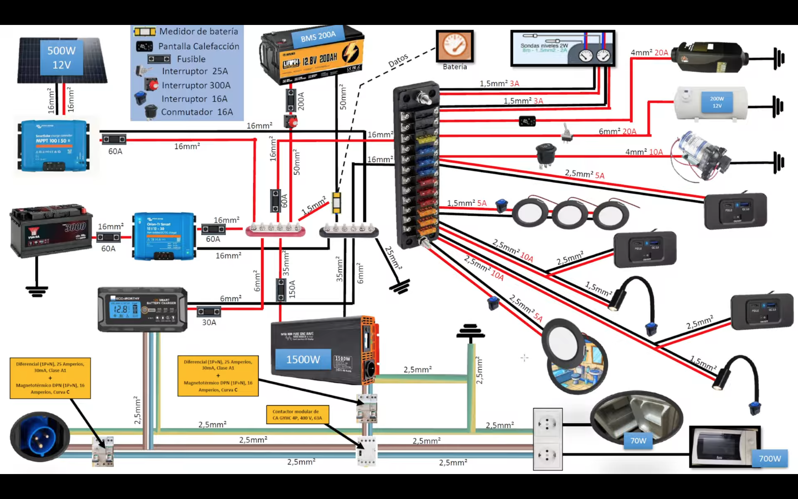

# Camper Esquema Electrico

Un dia con 10h de luz, podriamos generar 2500Wh

- inverter 1500W
- panel @ 500W; eficiencia 50%
- battery 200Ah o 2400Wh

## SISTEMA DE CARGA Y ALMACENAMIENTO

- Instalación de batería LiFePO4 de 12.8V y 200Ah con un BMS de 200A.
- Conexión de placa solar de 500W gestionada por un regulador MPPT 100/150.
- Uso de un cargador Booster Orion-Tr Smart de 30A conectado a la batería principal Yuasa.

## CIRCUITO DE 220V Y PROTECCIONES

- Instalación de un inversor de onda pura de 1500W para usar microondas de 700W y otros aparatos.
- Sistema de carga a red con cargador inteligente Eco-Worthy de 20A.
- Uso de protecciones con diferenciales de 25A / 30mA y magnetotérmicos de 16A.

## references

- [youtube](https://www.youtube.com/watch?v=EoZXzKkNyO0)