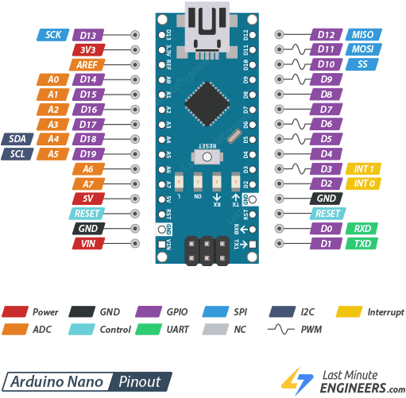
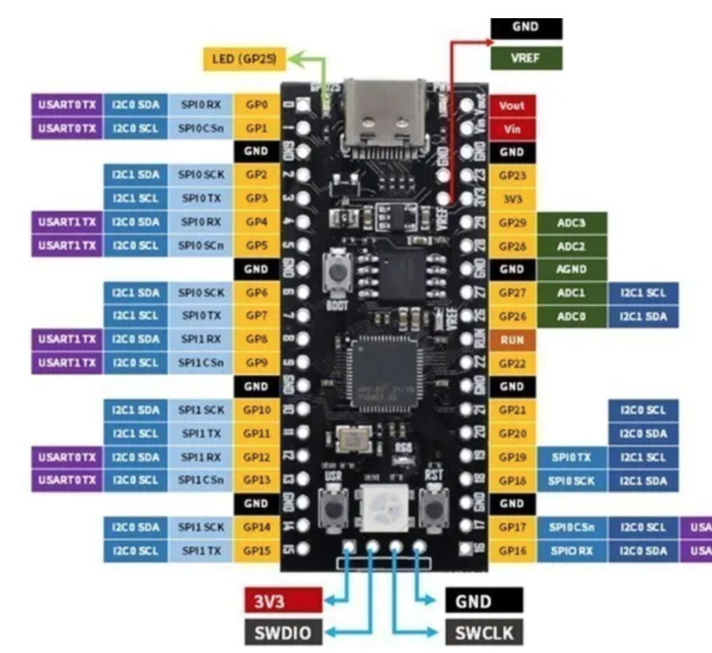

# Deposito Water level

En el garaje, el motor se arranca cuando queramos inyectar agua al deposito y/o cargar las baterias.
Problema: no se sabe por donde esta el nivel!

## Solucion 

La PiZero conectada a la WiFi, corre un node-red que recibe un mensaje UART y lo muestra en un gauge.

- PiZero + Max485 + 100m cable
- MPTT para Router 4G (reuso)

## Aguas arriba

- Alimentacion por panel solar 6V + MPPT + 18650

**Option 1**

- SR04M Sensor ultrasonidos. 
- A. Nano (R. Pico) con Max485.
- A. Nano lee el sensor, calcula la distancia
- RS485, modo unidirectional cada 2 mins 

**Option 2**

- Seedstudio RS485, en modo bidireccional

## Material

## AliExpress

- JSN-SR04T/AJ-SR04M Sensor de medición de distancia integrado a prueba de agua.
- MPPT regulador de panel solar de 6V para batería de litio 3,7V 4,2V CN3791
- RP2040 Raspbery Pico, USB-C + módulo RS485 TTL

## Referencias

- [DIY or BUY](https://www.youtube.com/watch?v=jriRW4rGQp4&t=224s)
- https://how2electronics.com/modbus-rtu-with-raspberry-pi-pico-micropython/
- 