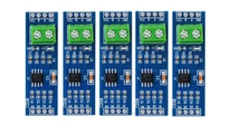

# Deposito Water level

	- Aguas [arriba](a_arriba.md)
	- Aguas [abajo](a_abajo.md)

## Fotos

## Pedido AliExpress

- JSN-SR04T/AJ-SR04M Sensor Ultrasonico: [datasheet](https://www.fabian.com.mt/viewer/42585/pdf.pdf)
- MPPT regulador de panel solar de 6V para batería de litio 3,7V 4,2V CN3791
- RP2040 Raspbery Pico, USB-C + módulo RS485 TTL

