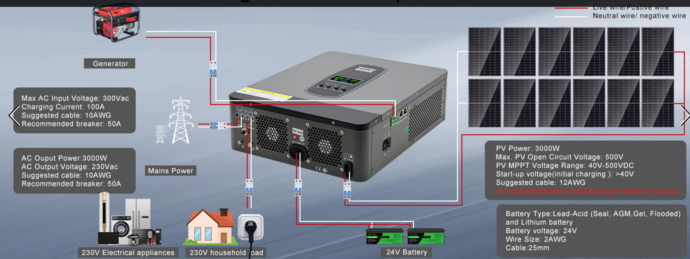

# Installing inverter

## PV

**50A** - Before connecting to PV modules, please install separately a DC circuit breaker between inverter and PV modules. 

**12AWG** - It's important for system safety and efficient operation to use appropriate cable for PV module connection, **4 mm2**

- Max. PV Array Open Circuit Voltage 40Vcc
- PV Array MPPT Voltage Range   40~500Vcc

## AC Out

**63A, 230Vac** - Caja Eléctrica Impermeable IP65, con diferencial e interruptor magneto/termico de 5 Vías 2x6A + 1x10A + 1x20A + 1x32A

**Installed** - Caja con IGA, ID y PIAs de 1x10 + 2x16A + 1x25A

**10 AWG, 6 mm2** - For 3KVA-5KVA models, insert AC input wires according to polarities indicated on terminal block and tighten the terminal screws. Be sure to connect PE protective conductor first (yellow-green). Remember neutral (blue)

Please follow below steps to implement AC input/output connection:

1. Before making AC output connection, be sure to open DC protector or disconnector first ()
2. Remove insulation sleeve 10mm for six conductors. And shorten phase L and neutral conductor N

## Batteries

**2AWG, 35 mm2** - Connect all battery packs as below chart. It’s suggested to connect at least 100Ah capacity battery for 1-3KVA model.

A separate DC overcurrent protector between battery and inverter. It may not be requested to have a disconnect device in some applications, however, it’s still requested to have over-current protection installed. Please refer to typical amperage in below table as required fuse or breaker size.