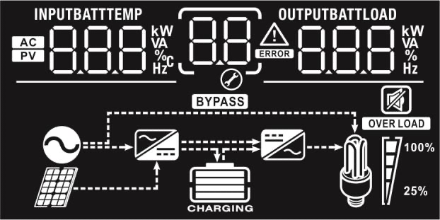

# User manual

## LED indicator

| . | **Inverter (Green)** |
| ------ | ----------- | 
| Solid On | Output is powered by utility in Line mode.
| Flashing | Output is powered by battery or PV in battery mode.

| . | **Charger (Green)** |
| ------ | ----------- | 
| Solid On | Battery is fully charged.
| Flashing | Battery is charging.

| . | **Fault (Red)** |
| ------ | ----------- | 
| Solid On | Fault occurs in the inverter.
| Flashing | Warning condition occurs in the inverter.

## Display icons

**Input Source Information**

- Indicates the AC input.
- Indicates the PV input
- Indicate input voltage, input frequency, PV voltage, charger current, charger power (only for MPPT models), battery voltage.

Configuration Program and Fault Information

- Indicates the setting programs.
- Indicates the warning and fault codes.

Output Information:

- Indicate output voltage, output frequency, load percent, load in VA, load in Watt and discharging current.
