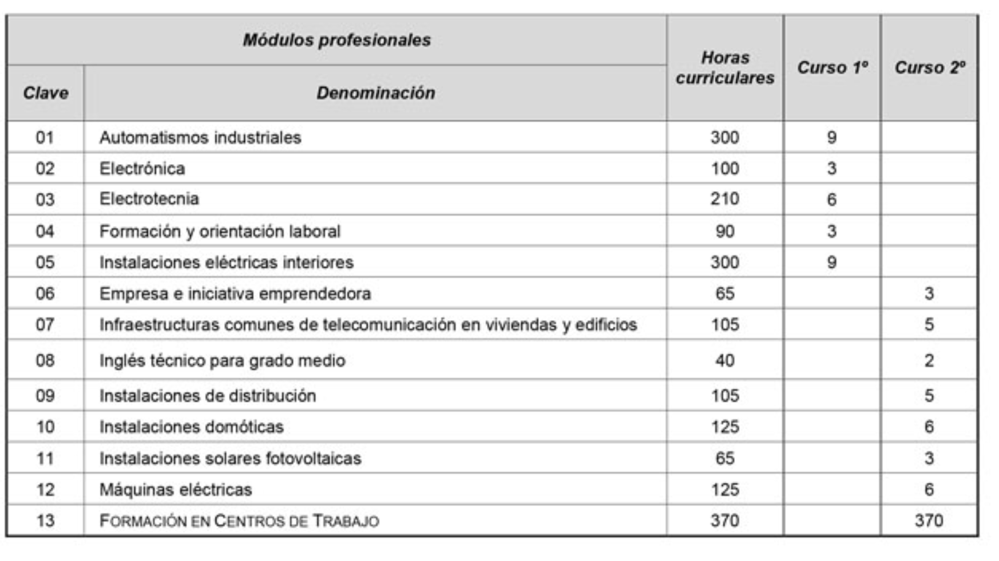

# Instalaciones Electricas y Automaticas

## Primer curso

​    Automatismos industriales.
​    Electrónica. Electrotecnia.
​    Instalaciones eléctricas interiores.

## Segundo curso

​    Instalaciones de distribución.
​    Infraestructuras ICTs
​    Instalaciones domóticas.
​    Instalaciones solares fotovoltaicas.
​    Máquinas eléctricas.

## Objetivos

    Montar y mantener infraestructuras de telecomunicación en edificios, instalaciones eléctricas de BT, máquinas eléctricas y sistemas automatizados.
    Configurar y calcular instalaciones y equipos.
    Montar los elementos componentes de redes de distribución de BT y elementos auxiliares.
    Montar los equipos y canalizaciones asociados a las instalaciones eléctricas y automatizadas e infraestructuras de telecomunicaciones en edificios.
    Instalar y mantener máquinas eléctricas rotativas y estáticas.
## Referencias

- https://raices.madrid.org/secretariavirtual/
- www.iesftv.com

