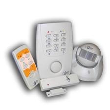

# Installed Features

## Coati Alarm

## Solar

- [Autosolar](https://autosolar.es/kit-solar-aislada/kit-solar-casa-campo-3000w-24v-6400whdia)

En vez de comprar el kit he puesto el inversor DatouBoss:

- voltaje máximo de circuito abierto del conjunto fotovoltaico: 500Vcc
- rango de voltaje MPPT: 40~500Vcc (2 paneles)
- corriente de carga máxima (cargador de CA + cargador fotovoltaico): 100A

Se pueden configurar tres modos de salida: prioridad fotovoltaica/prioridad de suministro/prioridad del inversor, que pueden satisfacer diferentes requisitos de aplicación de los usuarios. Además, el inversor híbrido tiene una disipación de calor inteligente, que activa diferentes efectos de disipación de calor dependiendo de la temperatura del dispositivo. 

| Concepto | Precio |
| -------- | ------ |
| Inversor | 255
| Paneles | 132
| Soporte | 64
| Cableado | 200 
| Baterias | 400

En Autosolar el kit sale por 1700 euros.

## Haverland Heaters