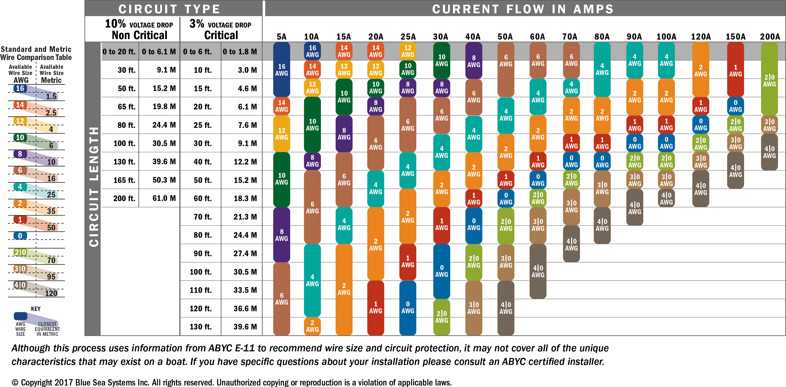

# Paneles, Cables y Baterias

Vamos a calcular el sistema de baterías de plomo ácido para una vivienda que necesita una autonomía de 2 días de consumos a 2 kWh por día

- Profundidad de descarga: para baterías de plomo-ácido (50%)
- Factor de corrección = 1,2 para plomo ácido.

    2 kWh (consumo) x 2 (días) x 1,2 (factor de corrección) / 0,5 (descarga) = 2,4 kWh.

**Tiempo de carga de la bateria/Numero de paneles**

| Paneles  | Carga (h) |
| -------- | --------- |
| 2 x 455W | 2.10      |
| 4 x 455W | 1.05      |
| 2 x 505W |           |

## Batteries

**2AWG, 35 mm2** - Connect all battery packs as below chart. It’s suggested to connect at least 100Ah capacity battery for 1-3KVA model.

A separate DC overcurrent protector between battery and inverter. It may not be requested to have a disconnect device in some applications, however, it’s still requested to have over-current protection installed. Please refer to typical amperage in below table as required fuse or breaker size.

## Instalation: AC Out

**63A, 230Vac** - Caja Eléctrica Impermeable IP65, con diferencial e interruptor magneto/termico de 5 Vías 2x6A + 1x10A + 1x20A + 1x32A

**Installed** - Caja con IGA, ID y PIAs de 1x10 + 2x16A + 1x25A

**10 AWG, 6 mm2** - For 3KVA-5KVA models, insert AC input wires according to polarities indicated on terminal block and tighten the terminal screws. Be sure to connect PE protective conductor first (yellow-green). Remember neutral (blue)

Please follow below steps to implement AC input/output connection:

1. Before making AC output connection, be sure to open DC protector or disconnector first ()
2. Remove insulation sleeve 10mm for six conductors. And shorten phase L and neutral conductor N

## Instalation: PV

**50A** - Before connecting to PV modules, please install separately a DC circuit breaker between inverter and PV modules. It's important for system safety and efficient operation to use appropriate cable for PV module connection, **4 mm2**

## Material

Amazon:

- 5AWG (16 mm2) de 50cm de longitud
- Fuse 150A, en paralelo con Breaker 200A, 24V

LiTime baterías 12V 100Ah admiten hasta 4 en serie y 4 en paralelo (máx. 4S4P) para más capacidad (200Ah, 300Ah, 400Ah) y mayor voltaje (24V, 36V, máx. 48V). Se puede conectar un máximo de 16 celdas para crear un sistema de baterías de 48V 400Ah, que proporciona un máximo de 20,48kWh de energía y 20,48kW de potencia de carga. 

- LiFePo4 con 100A BMS

Obramat:

- Estructura para módulos de hasta 2279 x 1150 mm y espesores de entre 30 y 45 mm.
- latiguillo (34 mm2) con agujero M8
- Battery wire: 2 x 8AWG (10 mm2) de 1.5m de longitud

## Opcion 455

Dimensiones del panel solar: 1903 × 1134 × 30 mm con 24,2 kg

| Parameter | Symbol | Value |
| --------- | ------ | ----- |
| Maximum Power | Pmax(W) | 455W
| Open Circuit Voltage | Voc(V) | 41.2V
| Shortcircuit Current | Isc(A) | 14.00A
| Max. Power Current | Imp(A) | 13.17A

## Opcion 505W

Dimensiones de 2093 x 1134 x 30mm con un peso de 26.3kg

| Parameter | Symbol | Value |
| --------- | ------ | ----- |
| Potencia nominal | Pmax | 505W
| Open circuit | (Voc) | 45.72V
| Shortcircuit | (Isc) | 14.00A
| Max power | (Imp) | 13.11A

After considering above two parameters, the recommended setup is two units in serie.

n paneles en serie:
- n * Vmp > 55Vdc
- n * Voc < 450Vdc